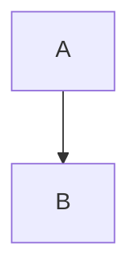

# Topic Analysis Skill

Deep analysis of abstract topics, concepts, or technologies through multi-agent research and brainstorming. Produces comprehensive documentation with Mermaid diagrams, converted to a styled standalone HTML report.

---

## Phase Flow

```
INITIALIZE → RESEARCH → BRAINSTORM → DOCUMENT → CONVERT → COMPLETE
```

---

## Phase 1: Initialize Session

### Create Session Directory

```
plans/sessions/{date}-analyze-{topic-slug}/
├── session.md          # Session tracking
├── research/           # Research findings
├── docs/               # Markdown documentation
└── report/             # Final HTML output
    └── index.html      # Styled HTML report
```

### Initialize Session File

Create `session.md` with:
- Topic description
- Phase tracking table (Initialize/Research/Brainstorm/Document/Convert/Complete)
- Checklist for completion gates

---

## Phase 2: Research Phase

### Agent Delegation (Parallel)

```
Task(docs-seeker, "Research external documentation for: {topic}")
  → Save to: research/external-docs.md

Task(pattern-researcher, "Research common patterns for: {topic}")
  → Save to: research/patterns.md
```

### Web Search

```
WebSearch("{topic} best practices 2025")
WebSearch("{topic} architecture patterns")
```
→ Save to: `research/current-trends.md`

### Summarize Research

```
Task(summarize-agent, "Summarize: research/")
```
→ Save to: `research/summary.md`

**GATE:** All research agents must complete before proceeding.

---

## Phase 3: Brainstorming Phase

Apply brainstorming principles for deeper understanding:

1. **One question at a time** - Never overwhelm
2. **Multiple choice preferred** - Offer concrete options
3. **Lead with recommendation** - Explain reasoning
4. **Incremental validation** - 200-300 word chunks

### Dialogue Flow

1. **UNDERSTAND** - What aspect interests you? Current level? Problem to solve?
2. **BOUNDARIES** - Scope? Related topics? Depth needed?
3. **KEY QUESTIONS** - Most important questions to answer?
4. **DIAGRAMS** - What processes need visualization?
5. **VALIDATE** - Present proposed structure, confirm sections

### Capture Understanding

Document in `research/brainstorm-notes.md`:
- User intent (aspect, level, use case)
- Scope boundaries (include/exclude/depth)
- Key questions to answer
- Diagram requirements
- Agreed structure

**GATE:** User must confirm analysis direction before documentation.

---

## Phase 4: Documentation Phase

### Generate Analysis Document

Create `docs/analysis.md` using template from:
`templates/analysis-template.md`

Required sections:
- Executive Summary
- Introduction (What/Why/Terminology)
- Core Concepts
- Architecture & Design (with Mermaid diagrams)
- Workflows & Processes (with sequence/state diagrams)
- Best Practices
- Common Patterns
- Pitfalls & Anti-Patterns
- Implementation Guide
- Resources & References

### Mermaid Diagram Types

| Type | Use Case |
|------|----------|
| `flowchart` | Process flows, decision trees |
| `sequenceDiagram` | Interactions, API calls |
| `stateDiagram-v2` | State machines, lifecycles |
| `classDiagram` | Object relationships |
| `erDiagram` | Data models |
| `mindmap` | Concept hierarchies |

**GATE:** Markdown must include all required sections and diagrams.

---

## Phase 5: HTML Conversion Phase

### Convert Markdown to HTML

Use template from: `templates/html-template.html`

1. Parse markdown (headings, paragraphs, lists, tables, code blocks)
2. Convert Mermaid blocks to `<div class="mermaid">`
3. Apply HTML structure with semantic elements
4. Embed CSS styling (professional, responsive)
5. Include Mermaid.js CDN for diagram rendering

### Mermaid Block Transformation

```markdown

```

Becomes:

```html
<div class="mermaid">
flowchart TD
    A --> B
</div>
```

**GATE:** HTML file must render correctly with working Mermaid diagrams.

---

## Phase 6: Completion Phase

### Final Output Structure

```
plans/sessions/{date}-analyze-{topic-slug}/
├── session.md              # Updated with completion
├── research/
│   ├── external-docs.md
│   ├── patterns.md
│   ├── current-trends.md
│   ├── brainstorm-notes.md
│   └── summary.md
├── docs/
│   └── analysis.md
└── report/
    └── index.html          # FINAL OUTPUT
```

### Announce Completion

```
ANALYSIS COMPLETE

Topic: {topic}
Session: plans/sessions/{session}/

HTML Report: report/index.html

To view: open plans/sessions/{session}/report/index.html

Key Findings:
- [Finding 1]
- [Finding 2]
- [Finding 3]
```

---

## Quality Gates Summary

| Phase | Gate |
|-------|------|
| Initialize | Session directory created |
| Research | All agents completed |
| Brainstorm | User confirms direction |
| Document | Markdown with diagrams exists |
| Convert | HTML renders correctly |
| Complete | All files saved |

---

## Error Handling

- **Research fails**: Request additional context or narrow scope
- **Brainstorming stalls**: Ask specific clarifying questions
- **HTML conversion fails**: Save markdown, retry conversion
- **Topic too broad**: Offer to narrow, overview, or focus on implementation
