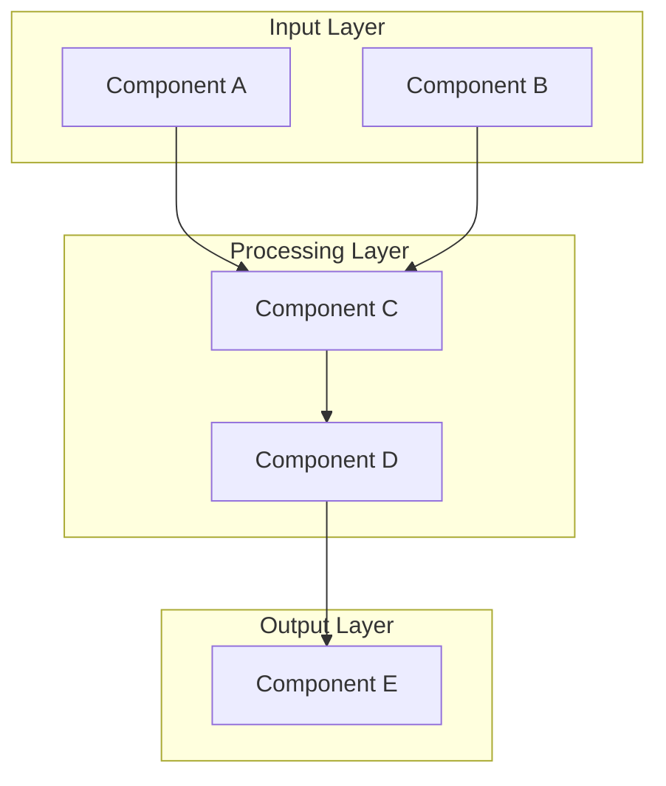
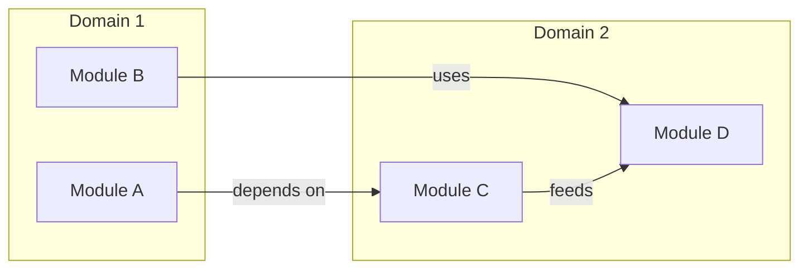
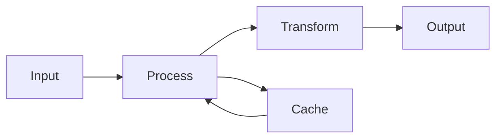
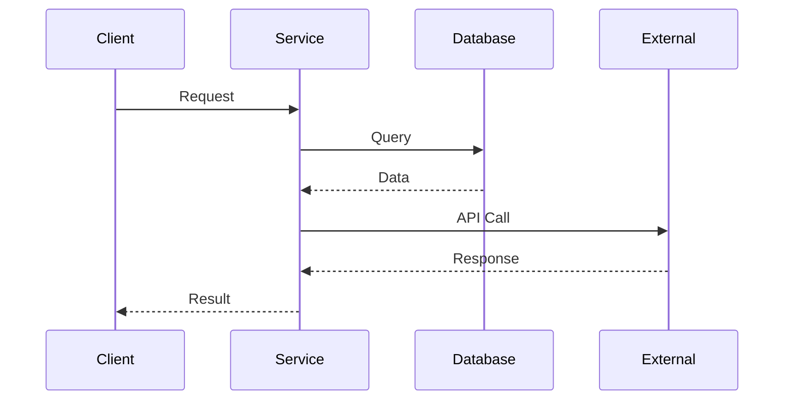
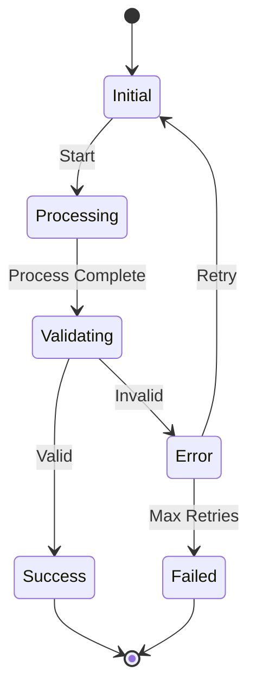
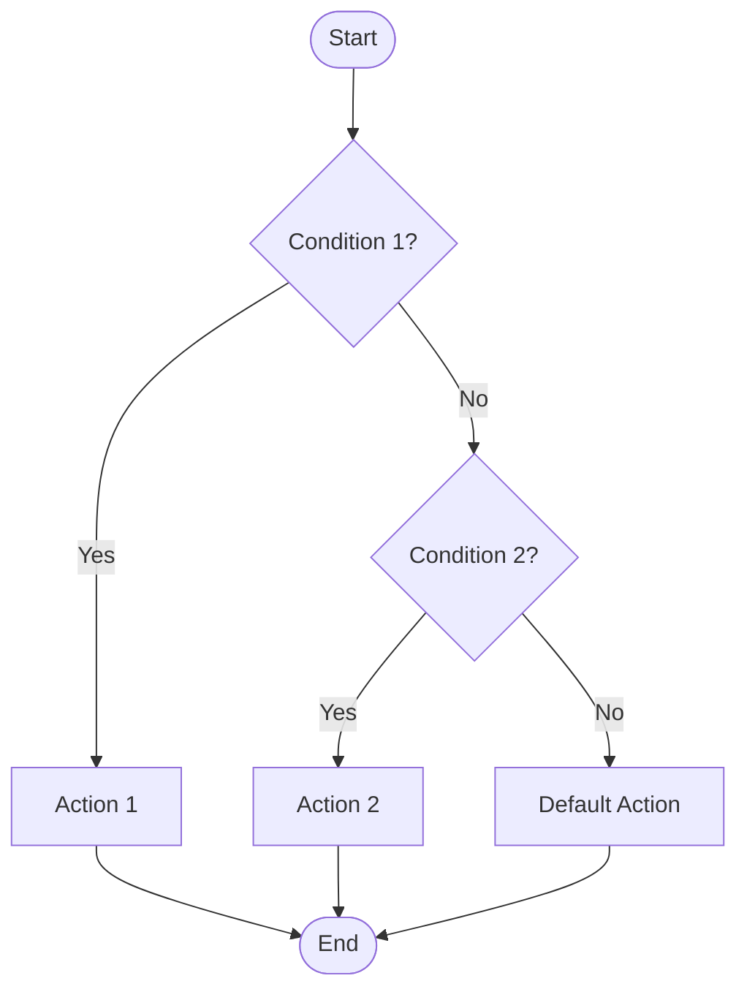
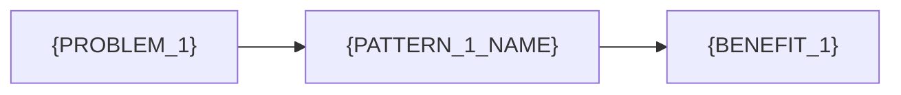
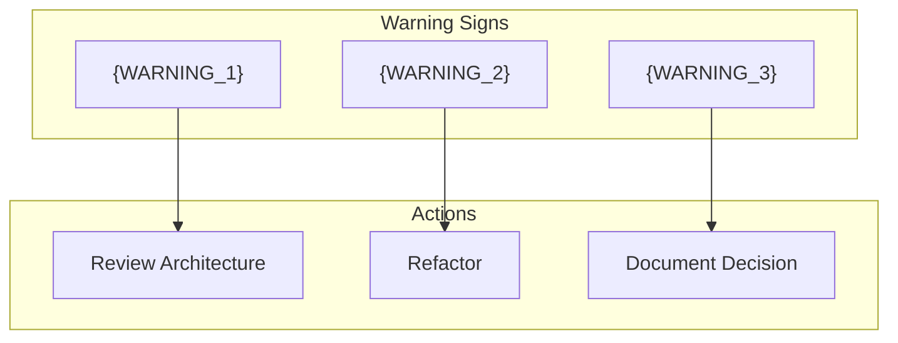

# {TOPIC}: Comprehensive Analysis

**Generated:** {DATE}
**Session:** {SESSION_ID}

---

## Executive Summary

{EXECUTIVE_SUMMARY}

---

## Table of Contents

1. [Introduction](#introduction)
2. [Core Concepts](#core-concepts)
3. [Architecture & Design](#architecture--design)
4. [Workflows & Processes](#workflows--processes)
5. [Best Practices](#best-practices)
6. [Common Patterns](#common-patterns)
7. [Pitfalls & Anti-Patterns](#pitfalls--anti-patterns)
8. [Implementation Guide](#implementation-guide)
9. [Resources & References](#resources--references)

---

## Introduction

### What is {TOPIC}?

{DEFINITION}

### Why It Matters

{VALUE_PROPOSITION}

### Key Terminology

| Term | Definition |
|------|------------|
| {TERM_1} | {DEFINITION_1} |
| {TERM_2} | {DEFINITION_2} |
| {TERM_3} | {DEFINITION_3} |

---

## Core Concepts

### Concept 1: {CONCEPT_1_NAME}

{CONCEPT_1_EXPLANATION}

**Key Points:**
- {POINT_1}
- {POINT_2}
- {POINT_3}

### Concept 2: {CONCEPT_2_NAME}

{CONCEPT_2_EXPLANATION}

**Key Points:**
- {POINT_1}
- {POINT_2}
- {POINT_3}

---

## Architecture & Design

### System Overview

{ARCHITECTURE_DESCRIPTION}

### Component Relationships

{COMPONENT_RELATIONSHIPS}

### Data Flow

{DATA_FLOW_DESCRIPTION}

---

## Workflows & Processes

### Primary Workflow

{WORKFLOW_DESCRIPTION}

### State Transitions

{STATE_DESCRIPTION}

### Decision Flow

{DECISION_DESCRIPTION}

---

## Best Practices

### Do This

| Practice | Description | Benefit |
|----------|-------------|---------|
| {PRACTICE_1} | {DESCRIPTION_1} | {BENEFIT_1} |
| {PRACTICE_2} | {DESCRIPTION_2} | {BENEFIT_2} |
| {PRACTICE_3} | {DESCRIPTION_3} | {BENEFIT_3} |

### Key Recommendations

1. **{RECOMMENDATION_1}**
   - {DETAIL_1}
   - {DETAIL_2}

2. **{RECOMMENDATION_2}**
   - {DETAIL_1}
   - {DETAIL_2}

3. **{RECOMMENDATION_3}**
   - {DETAIL_1}
   - {DETAIL_2}

---

## Common Patterns

### Pattern 1: {PATTERN_1_NAME}

**Problem:** {PROBLEM_1}

**Solution:** {SOLUTION_1}

**When to Use:**
- {USE_CASE_1}
- {USE_CASE_2}

### Pattern 2: {PATTERN_2_NAME}

**Problem:** {PROBLEM_2}

**Solution:** {SOLUTION_2}

**When to Use:**
- {USE_CASE_1}
- {USE_CASE_2}

### Pattern Comparison

| Pattern | Use Case | Complexity | Trade-offs |
|---------|----------|------------|------------|
| {PATTERN_1} | {USE_CASE_1} | {COMPLEXITY_1} | {TRADEOFF_1} |
| {PATTERN_2} | {USE_CASE_2} | {COMPLEXITY_2} | {TRADEOFF_2} |

---

## Pitfalls & Anti-Patterns

### Pitfall 1: {PITFALL_1_NAME}

**Why it happens:** {CAUSE_1}

**Consequences:** {CONSEQUENCE_1}

**How to avoid:**
- {PREVENTION_1}
- {PREVENTION_2}

### Pitfall 2: {PITFALL_2_NAME}

**Why it happens:** {CAUSE_2}

**Consequences:** {CONSEQUENCE_2}

**How to avoid:**
- {PREVENTION_1}
- {PREVENTION_2}

### Warning Signs

---

## Implementation Guide

### Prerequisites

Before implementing, ensure you have:
- [ ] {PREREQUISITE_1}
- [ ] {PREREQUISITE_2}
- [ ] {PREREQUISITE_3}

### Step 1: {STEP_1_NAME}

{STEP_1_DESCRIPTION}

**Actions:**
1. {ACTION_1}
2. {ACTION_2}
3. {ACTION_3}

### Step 2: {STEP_2_NAME}

{STEP_2_DESCRIPTION}

**Actions:**
1. {ACTION_1}
2. {ACTION_2}
3. {ACTION_3}

### Step 3: {STEP_3_NAME}

{STEP_3_DESCRIPTION}

**Actions:**
1. {ACTION_1}
2. {ACTION_2}
3. {ACTION_3}

### Verification Checklist

- [ ] {VERIFICATION_1}
- [ ] {VERIFICATION_2}
- [ ] {VERIFICATION_3}

---

## Resources & References

### Official Documentation
- [{RESOURCE_1}]({URL_1})
- [{RESOURCE_2}]({URL_2})
- [{RESOURCE_3}]({URL_3})

### Further Reading
- [{ARTICLE_1}]({URL_1}) - {DESCRIPTION_1}
- [{ARTICLE_2}]({URL_2}) - {DESCRIPTION_2}

### Tools & Libraries
| Tool | Purpose | Link |
|------|---------|------|
| {TOOL_1} | {PURPOSE_1} | [{LINK_1}]({URL_1}) |
| {TOOL_2} | {PURPOSE_2} | [{LINK_2}]({URL_2}) |

### Community Resources
- [{COMMUNITY_1}]({URL_1})
- [{COMMUNITY_2}]({URL_2})

---

## Appendix

### Glossary

| Term | Definition |
|------|------------|
| {TERM_1} | {DEFINITION_1} |
| {TERM_2} | {DEFINITION_2} |

### Changelog

| Date | Change |
|------|--------|
| {DATE} | Initial analysis created |

---

*Generated by /analyze command*
